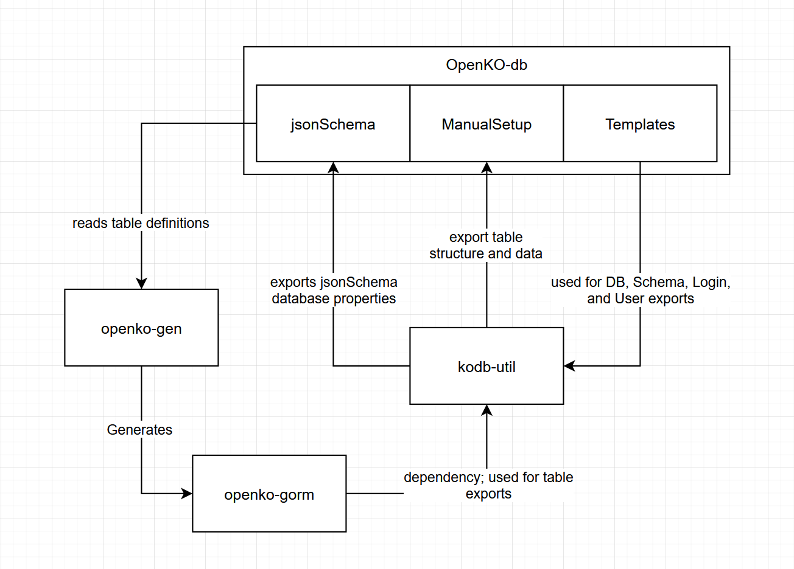

# OpenKO Database Project
The dataset contained in this project is the official dataset used for OpenKO development.  There are tools available to
import and export this data to a SQL server instance.  These will be covered in the `Tools` section

`openko-db` contains the definition of the database and the *.sql files to create and populate it with a default dataset.

These artifacts include:
`jsonSchema`: contains the database table definitions as well as additional properties used in code generation.
`ManualSetup`: contains all sql required to create the database and load default data.  The run order of the scripts are ordered.
`Templates`: contains Sql template files used by the export tool to generate DBs, Schemas, Users and Logins.

## Tools
A toolchain was developed to enable us to manage our database with version control:

1. `jsonSchema` from this project is the database table definition used by a code generator tool, `openko-gen`. 
2. `openko-gen` generates code libraries from the jsonSchema definitions.  Currently generated libraries: `openko-gorm`
3. `openko-gorm`: Go Object Relational Mapping (gorm) model library; built for use in the `kodb-util` project
4. `kodb-util` is a tool that creates/imports the OpenKO database, as well as exports the structure, data and jsonSchema database properties

In most cases a developer will likely just want to use `kodb-util` to import and export data.  Structural changes will 
require the assistance of the maintainers to approve changes to jsonSchema and run the related code generation processes.

## Manual creation
You can run these scripts one by one to create the database, although it'll be very tedious. To manually create the database:

1. Run the scripts in ManualSetup that start with 1_, 2_, 3_, 4_ and 5_. 
2. Run the insert scripts in ManualSetup starting 6_.  Note that you'll have to manually separate your batches into groups of 1000 or less.  Our exports do not include pre-defined batches to make the git diffs more manageable, and so that the import tool can have an adjustable batch size for performance adjustments.
3. Run the create view and stored procedure scripts in 7_ and 8_ files